# VSCode and RenderDoc HDR KTX2 Viewer

University of Pennsylvania, CIS 565: GPU Programming and Architecture Fall 2025, Final Project.

_A project by Caroline Fernandes, Harris Kokkinakos, Christina Qiu, and Rachel Lin._

[Project Pitch Document](https://github.com/0cfernandes00/565_FinalProject/blob/main/output_images/presentations/GPUFinalProjectPitch.pdf)

## Demos
[Live Website](https://harriskoko.github.io/VSCode-KTX-Viewer/)

Users will have 3 different ways to access our work:
- Inside of the glTF VSCode plugin, our tool is launched when users load a glTF with KTX2 textures
- Our standalone website found (here's the [github]((https://github.com/HarrisKoko/VSCode-KTX-Viewer.git))
- RenderDoc extension 

## Supported Compression Types

Don Mccurdy's [website](https://github.com/donmccurdy/KTX2-Samples) shows the various compression types for KTX2 and were a great resource for us to test out our tool.
We were able to support the majority of the 2d formats.

 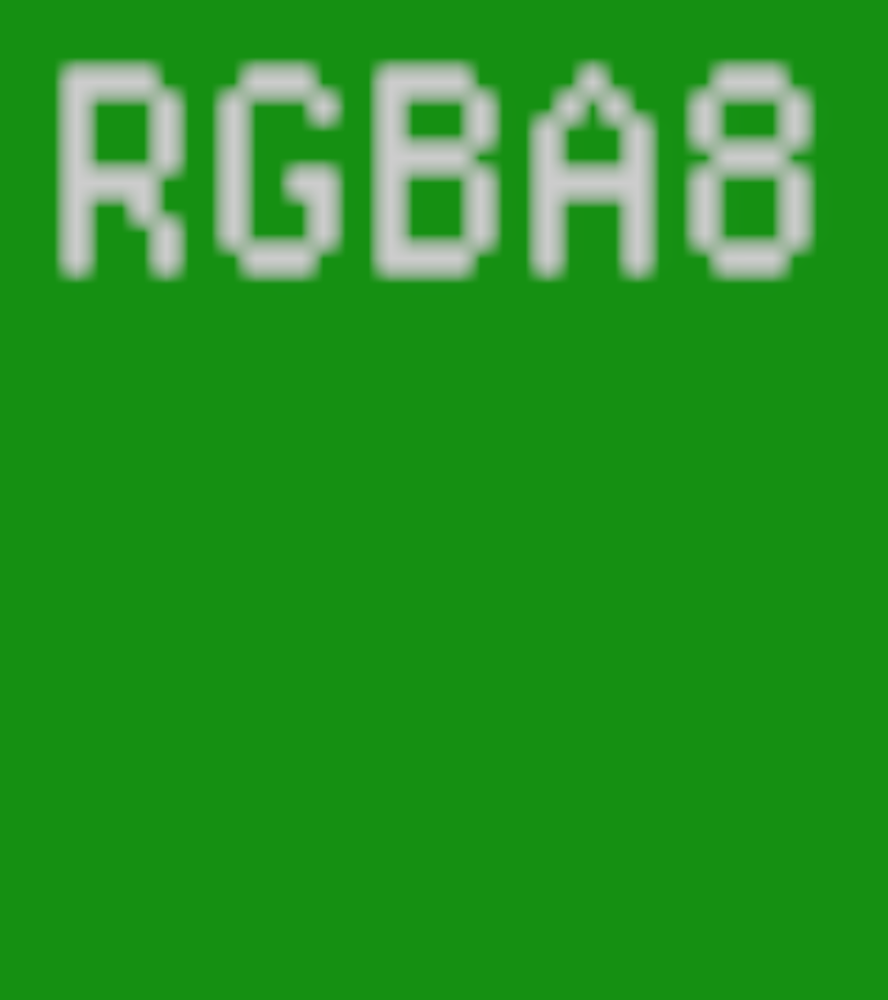 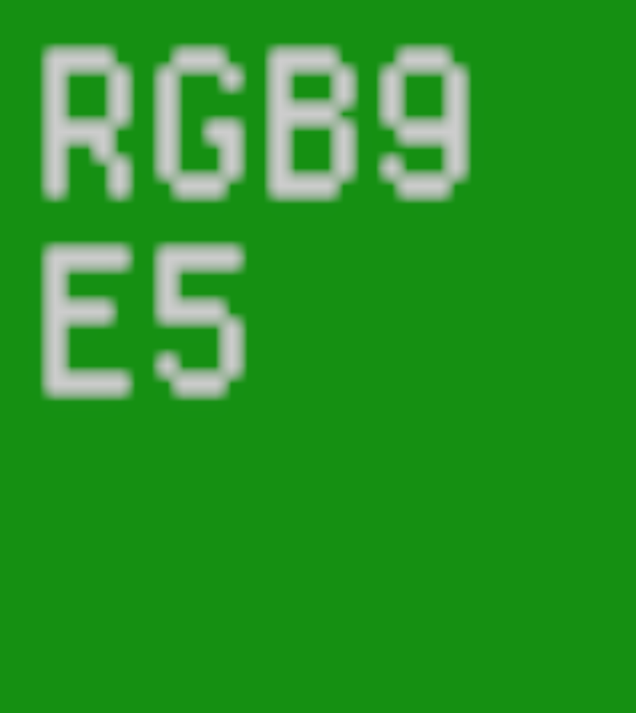 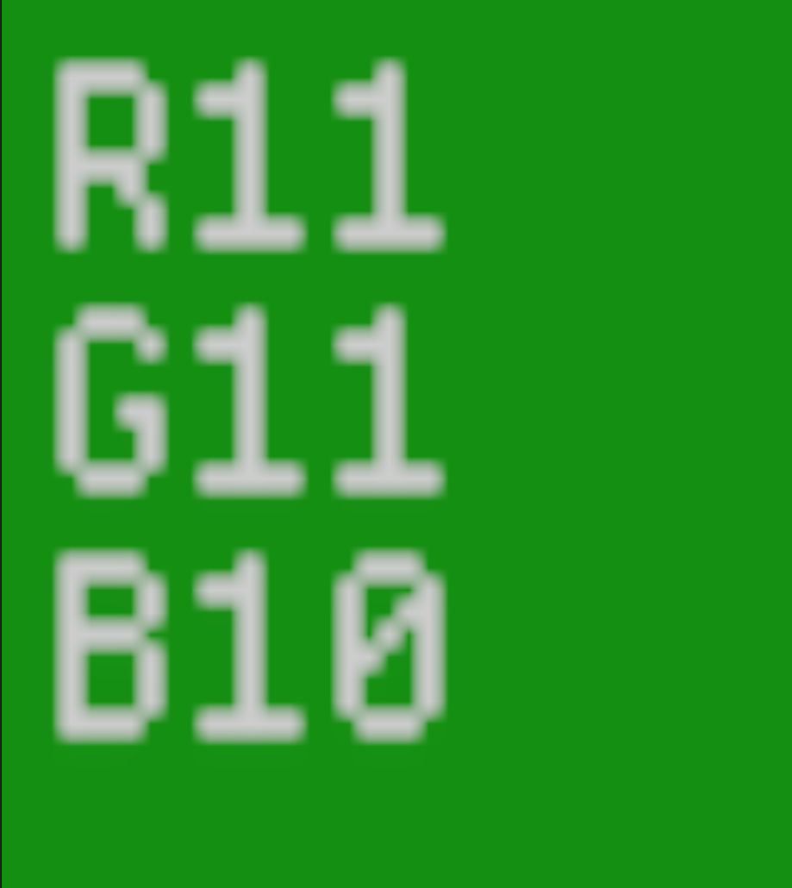 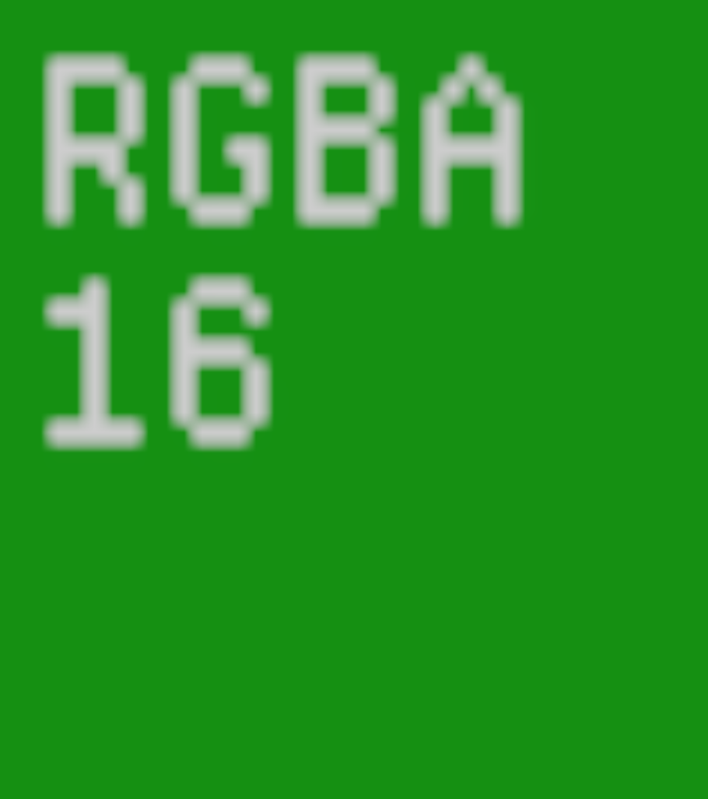

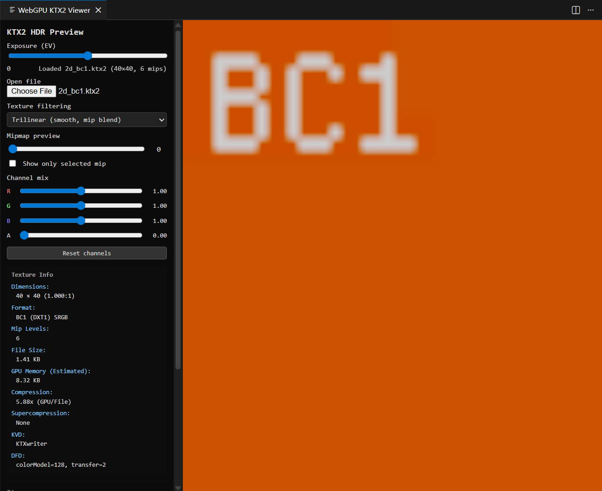 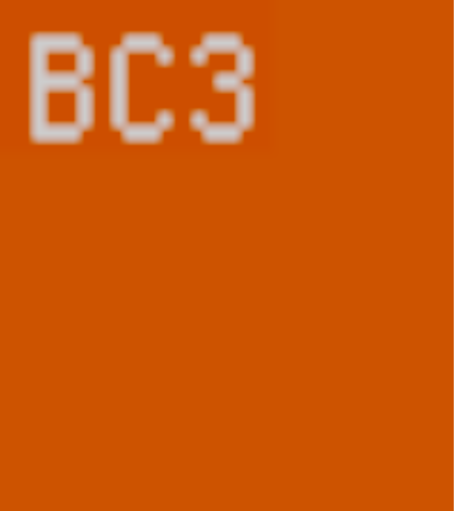 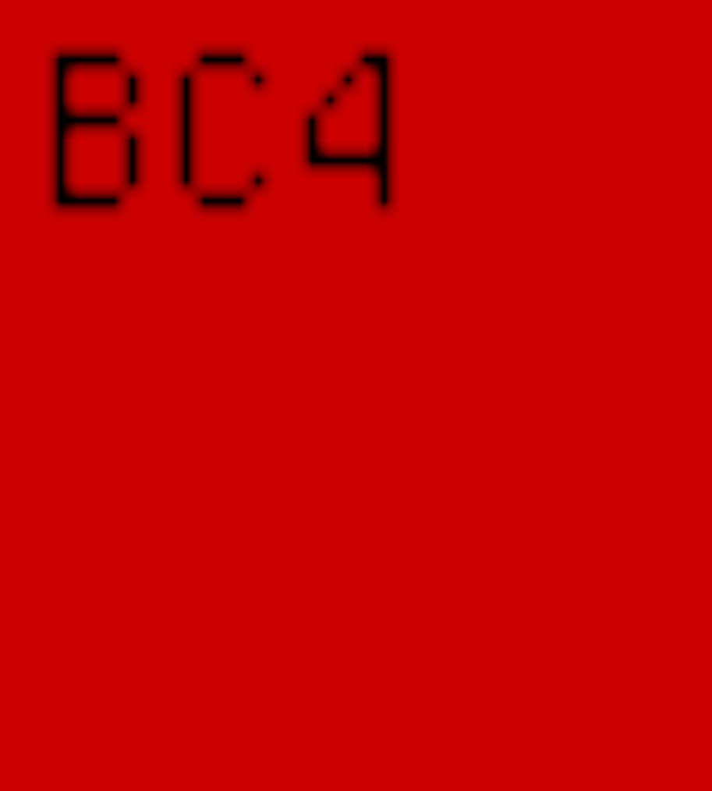 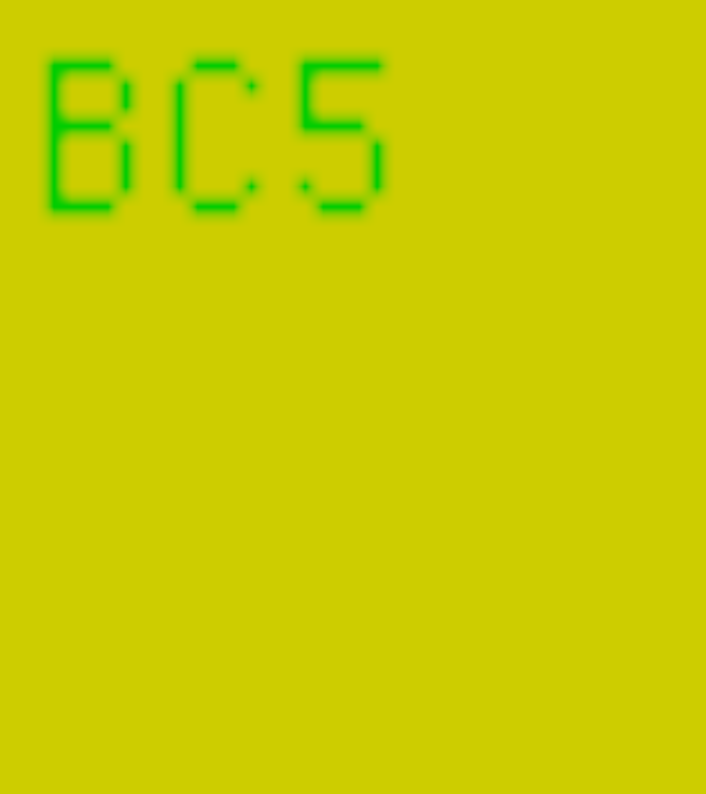 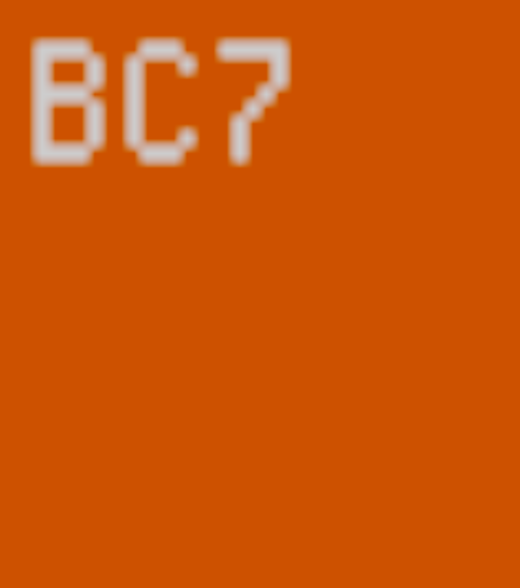

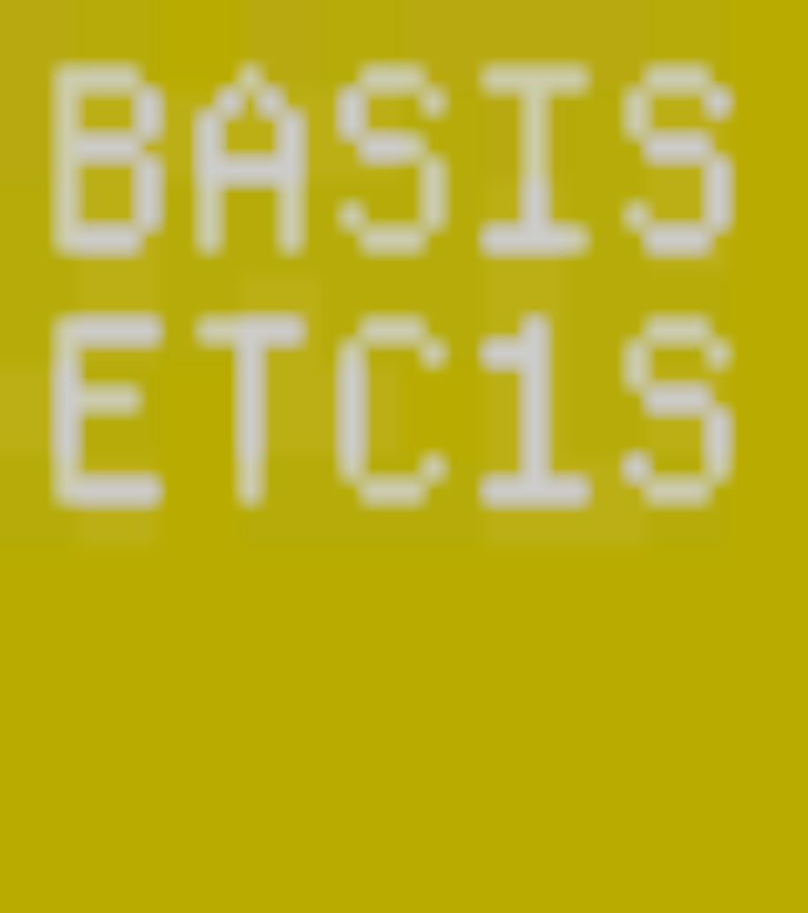 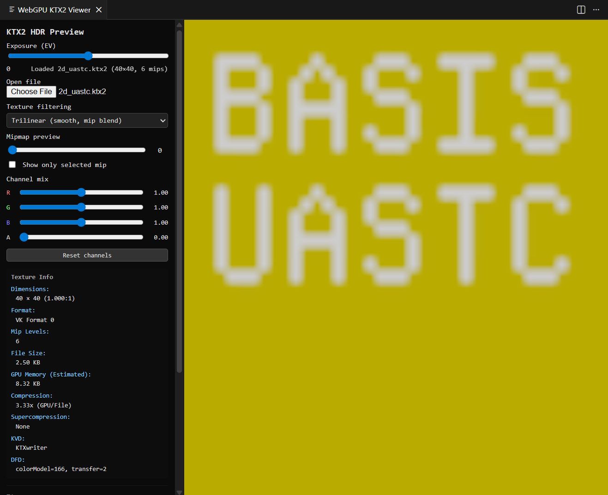

The full list of supported compression types include:
- BC1-7
- ETC1S
- ETC1/2(on mobile)
- UASTC
- basis 
- uncompressed (RGBA8, etc.)
  
# Sections 
- [Introduction](https://github.com/0cfernandes00/565_FinalProject/blob/main/README.md#introduction)
- [Technical Overview](https://github.com/0cfernandes00/565_FinalProject/blob/main/README.md#technical-overview)
- [Milestone Development](https://github.com/0cfernandes00/565_FinalProject/blob/main/README.md#milestone-development)
- [Setup](https://github.com/0cfernandes00/565_FinalProject/blob/main/README.md#setup)
- [References](https://github.com/0cfernandes00/565_FinalProject/blob/main/README.md#references)

## Introduction
KTX2Viewer was created to provide an open-source cross-platform SDR + HDR viewer that allows developers and artists to accurately visualize KTX2 textures. The project aims to extend RenderDoc and VSCode's gLTF plugin. Users will have access to information such as channels, alpha blending, mipmap visualization, and tonemapping to interact with.

Our motivation for this project came from Binomial co-founders Steph Hurlburt and Rich Geldreich. They pointed out the need in the industry for a tool that would allow previewing of KTX2 textures.

## Technical Overview

**What is KTX2?**
KTX2 is a universal container format for GPU textures. When working with GPU textures, there are many different texture compression types that GPUs use based on the type of GPU. For example, desktop GPUs often rely on BC compression types whereas mobile GPUs may use ETC. There are various versions of these compression types as well based on the type of texture, required details, and file size restrictions. KTX2 is a wrapper for all of these, allowing for the use of a singular file type for any of these compression types. Game studios and other companies relying on rendering often pre-compress their textures so that less data has to be sent to the GPU via PCIE. KTX2 helps developers organize and upload these texture efficiently. 

### Format Decoding/Encoding
Our KTX2Viewer aims to support both native GPU block-compressed formats and Basis Universal formats by implementing a full KTX2 parsing and transcoding pipeline in WebGPU. We currently utilize one library:

* <b>basis_transcoder.js / basis_transcoder.wasm</b> — The Binomial Basis Universal transcoder, used for converting ETC1S and UASTC texture payloads into GPU-ready BC formats.

KTX2 files may store texture data in one of two universal formats:

* <b>ETC1S</b> — A highly compressed, entropy-coded format using global codebooks stored in the KTX2 supercompression data block.

* <b>UASTC</b> — A high-quality format similar to BC7 blocks, but still requiring transcoding for WebGPU consumption.

WebGPU does not accept ETC1S or UASTC bitstreams directly. Instead, the viewer detects these cases through the KTX2 header (e.g., vkFormat = 0) and DFD metadata, then routes them to the transcoder.

### Transcoding Pipeline

1. KTX2 File Parsing
   * The viewer loads the file and parses all container structures, including the header, level index, DFD, key/value data, and supercompression global data. This ensures correct interpretation of byte offsets and alignment rules.
   * We detect:
     * Whether the KTX2 uses Basis Universal (ETC1S or UASTC)
     * Whether the KTX2 contains already-compressed GPU-native data
     * Whether the user’s GPU supports BC / ETC2 / ASTC via adapter.features

2. Full-File Transcoding
   * Transcoding happens in two cases:
     * The texture is ETC1S or UASTC (Basis Universal), indicated by vkFormat == 0
     * The texture is ETC2 but the GPU does not support texture-compression-etc2
   * The viewer uses a unified transcoding path (transcodeFullKTX2) to decode all mip levels in one pass. This ensures:
     * correct handling of global codebooks
     * consistent block interpretation across mips
     * correct decoding for both ETC1S and UASTC payloads

3. Selection of GPU Format
   * The viewer currently targets high-quality BC formats for maximum visual fidelity:
     * ETC1S → BC7
     * UASTC → BC7
   * Native BC formats (BC1/BC3/BC4/BC5/BC7) bypass the transcoder and are uploaded directly.

4. Block-Compressed Upload to WebGPU
   * After transcoding, mip levels are padded to WebGPU’s 256-byte bytesPerRow alignment using a block-row–aware padding routine. The texture is then created and uploaded level-by-level using the native WebGPU API.

## Milestone Development

### Milestone 1
[Milestone 1 PPT](https://github.com/0cfernandes00/565_FinalProject/blob/main/output_images/presentations/Milestone1Presentation.pdf)

For Milestone 1, our goal was to render ktx2 textures in each of our pipelines.

Outcome:
- Setup rendering pipeline on WebGPU/VSCode
- Enable RenderDoc to accept KTX2 files
- Parse KTX2 files in both pipelines and successfully view files with BC1,2,3,4,5,7 compression

VSCode Plugin

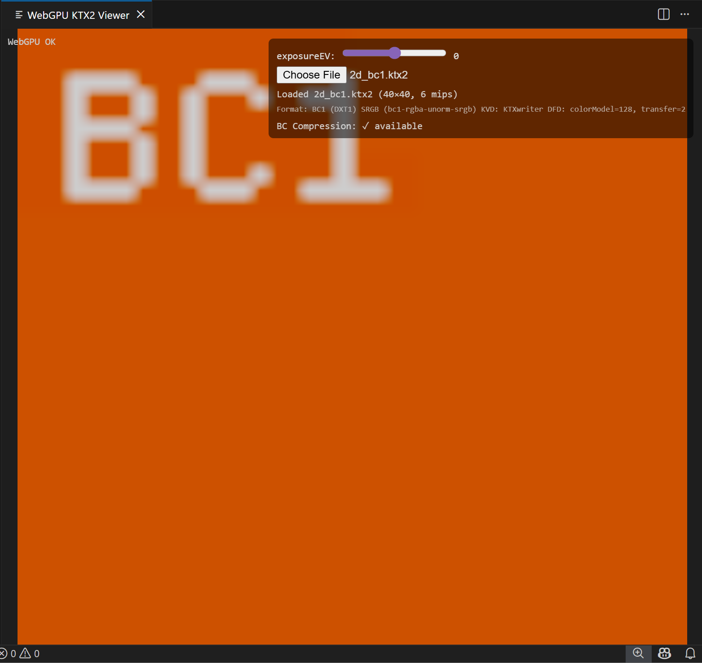 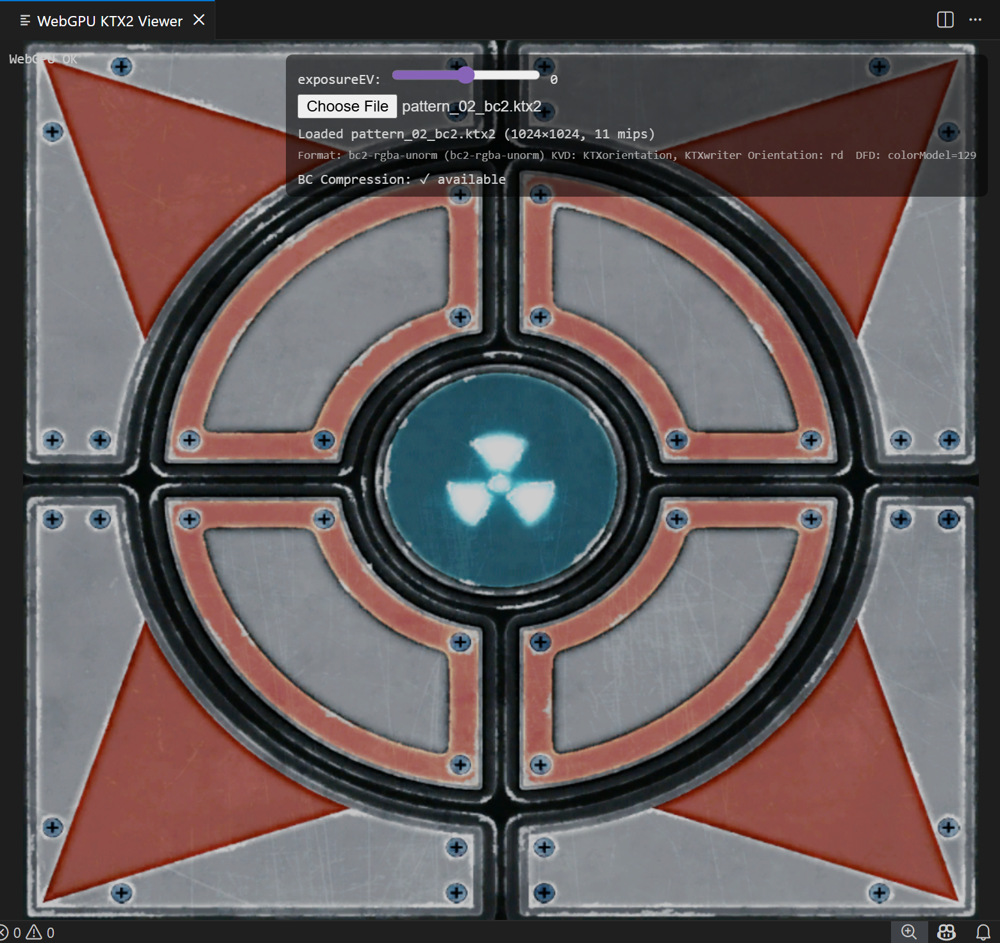 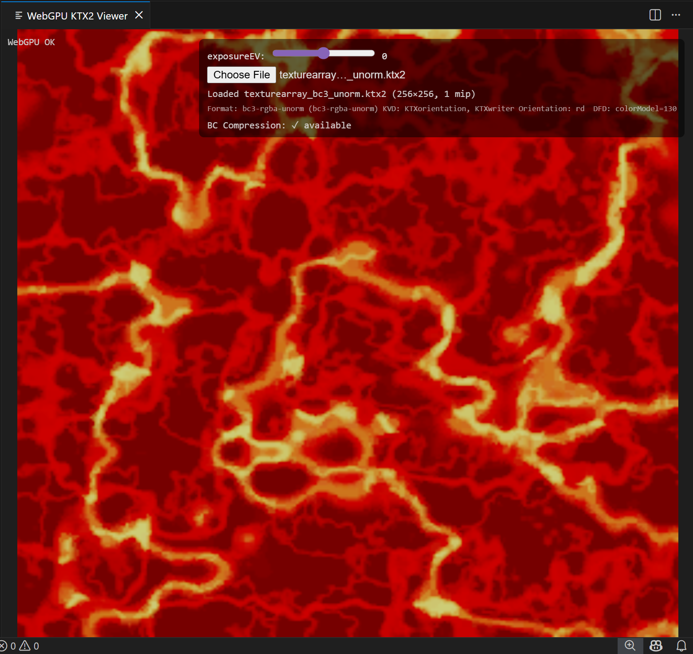 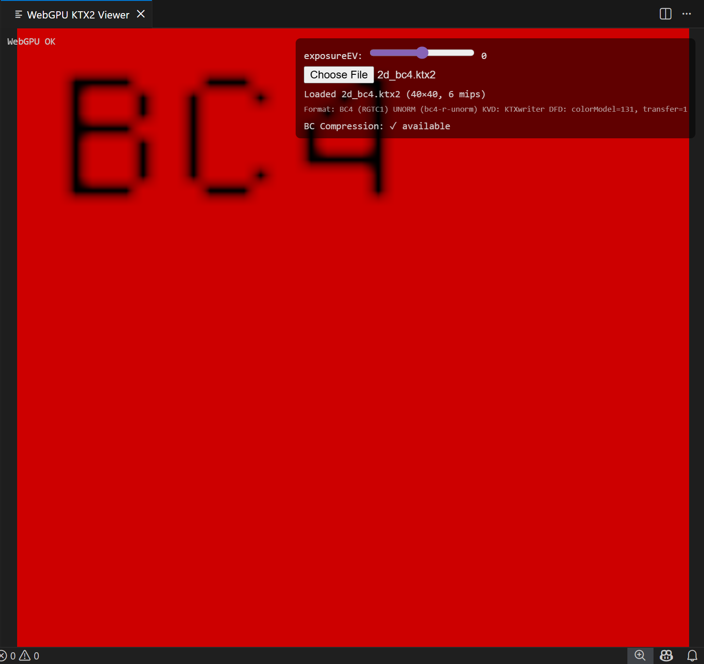 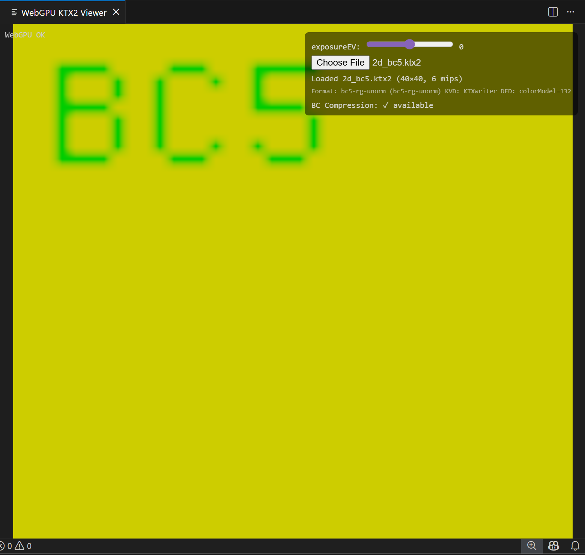 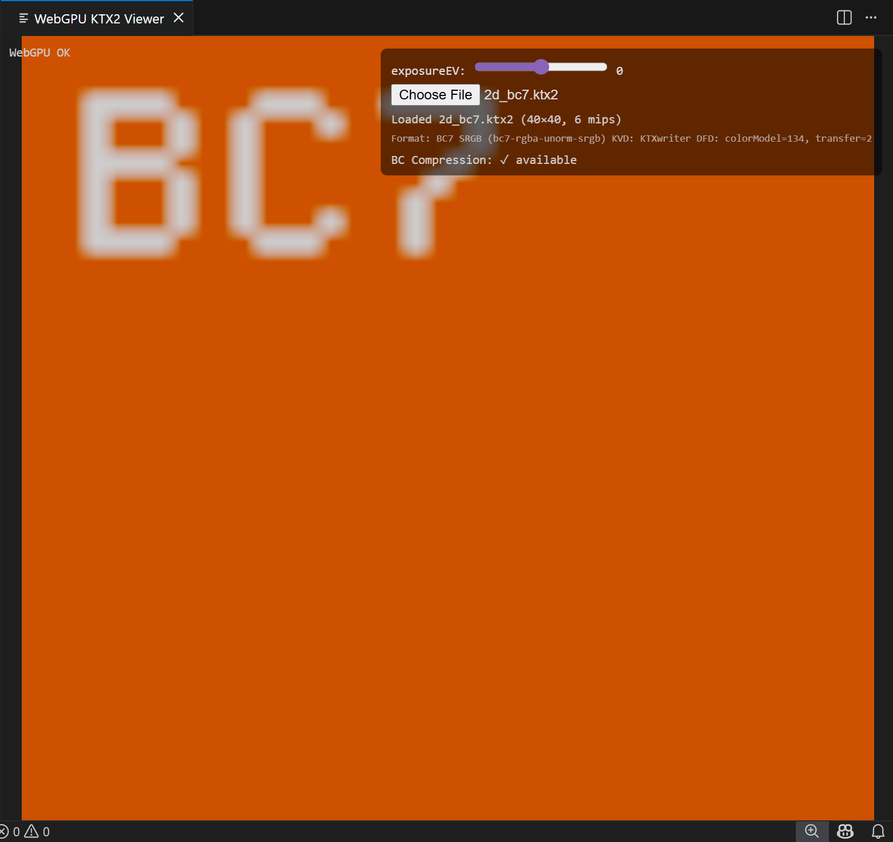 

RenderDoc

 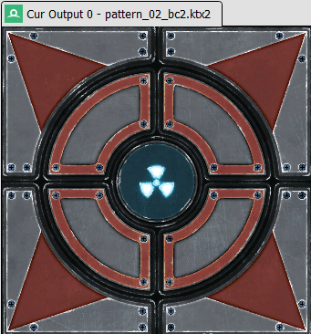 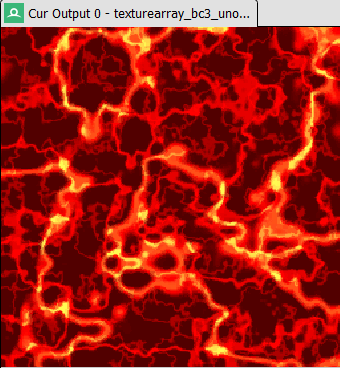 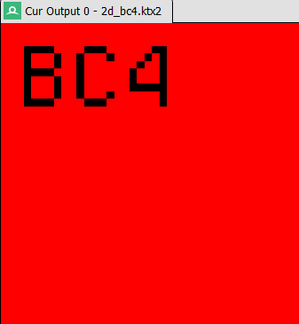 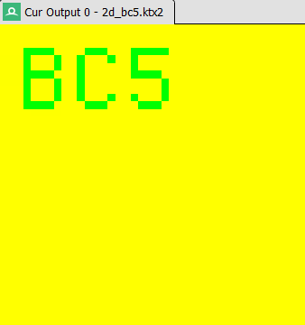 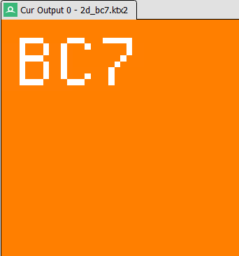 

### Milestone 2
[Milestone 2 PPT](https://github.com/0cfernandes00/565_FinalProject/blob/main/output_images/presentations/Milestone2Presentation.pdf)

For Milestone 2, our goal was to support HDR and add mobile GPU texture formats.

Outcome:
- Tonemapping modes 
  - Reinhard (in progress)
  - ACES (in progress)
  - Exposure 
- HDR
  - BC6H
- Supercompression formats

VSCode Plugin

During this milestone, HDR was integrated into the VSCode plugin. This was enabled by the use of VK_FORMATs 143 and 144, the formats for BC6H signed and unsigned rendering. Additionally, a slider was added to change exposer based on the ACES tonemapping. This enables the high range of color values to be properly displayed to the screen using the equation below where x represents the input hdr color.

A common issue with rendering HDR is the fidelity of colors. Many renderers struggle with color banding, an artifact produced by downsampling colors, causing noticable differences in colors rather than smooth gradients. The image on the left showcasees the VSCode extention's rendering of a gradient fromm white to black smoothly. The image on the right shows what it would look like if it were incorrectly rendering HDR with noticable color banding.

Additionally, we downloaded HDR files from polyhaven to test the capabilities of our previewer. Below shows images from the previewer on an HDR file compressed using unsigned BC6H and exported as a ktx2 file at varying exposure levels, showcasing the previewer's ability to maintain color fideelity within bright white shades and dark black shades.

RenderDoc

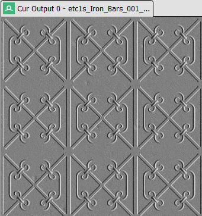 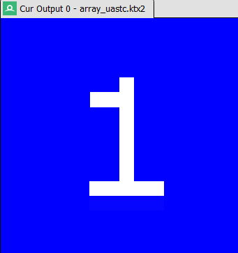 

### Milestone 3
[Milestone 3 PPT](https://github.com/0cfernandes00/565_FinalProject/blob/main/output_images/presentations/Milestone3Presentation.pdf)

For Milestone 3, our goal was to add UI and other features to expand functionality.

Outcome:
- User Interaction
  - alpha channels
  - blending functions
- gltf validate
- Tonemapping mode UI
  - None    
  - Reinhard
  - ACES
  - Exposure/Clamp
 
#### Web App and UI Overhaul
The VSCode plugin was adapted to also be used for a Web App version of the KTX2 viewer. Additioanlly, the UI was completely overhauled to have more information displayed to the user about the file they have loaded as well as more control over the preview. Mip and color channel viewing were added as well as texture info and log panels. 

#### Tonemapping

UI:

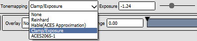

None:

Reinhard:

ACES:

Clamp:

## Setup

### VSCode
Users will clone the repo from this [link](https://github.com/HarrisKoko/VSCode-KTX-Viewer.git). 
Open the root of the folder in VSCode and run the following commands
npm install
npm run compile
press F5 to open an new window
ctrl+shift+p will open the search bar
type WebGPU and select the first option
Click the file selection to open a texture

### RenderDoc
Users can clone the repo, which will contain all of the external RenderDoc source code and binomial's transcoder.
Then they can simply open the solution file and build.

To preview a texture, drag and drop it into the texture field of the RenderDoc's viewport.

## References

- [KTX File Format Specification](https://registry.khronos.org/KTX/specs/2.0/ktxspec.v2.html)
- [KTX Parse](https://github.com/donmccurdy/KTX-Parse)
- [KTX Textures](https://github.com/donmccurdy/KTX2-Samples)
- [Example KTX2 Files](https://github.com/KhronosGroup/KTX-Software/tree/main/tests/testimages)
- [.dds Textures](https://opengameart.org/content/0-ad-textures)
- [VSCode Extension Guides](https://code.visualstudio.com/api/extension-guides/webview)
